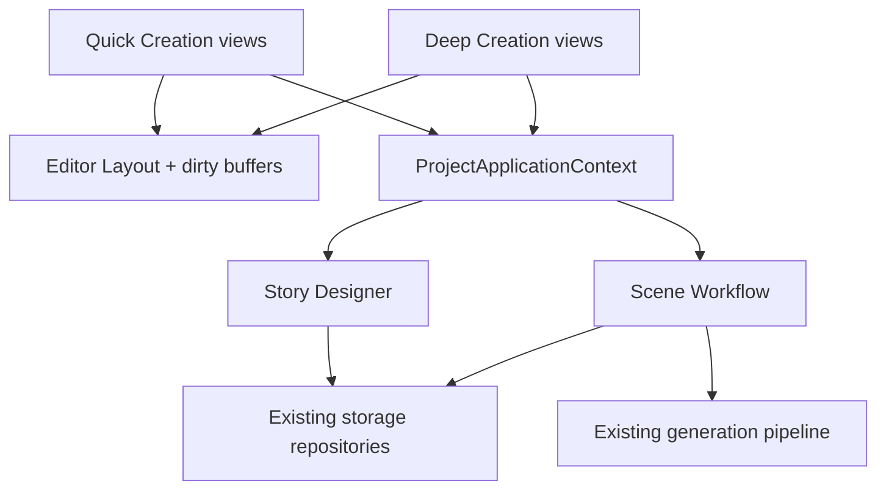

# NovelForge — One Engine, Two Creation Experiences

**Date:** 2026-07-26

**Status:** Decision-complete

**Scope:** Product and architecture design only; no implementation is included

**Current product reference:** [PRD.md](../../../PRD.md)

**Historical foundation:** [2026-06-04-novel-app-design.md](2026-06-04-novel-app-design.md)

## 1. Purpose and authority

NovelForge will offer two complete ways to work on the same novel:

- **快速创作 (Quick Creation):** turns an idea into approved chapters through compact, outcome-oriented screens.
- **深度创作 (Deep Creation):** exposes the existing Story Bible, outline, context, agent trace, review, and continuity controls.

The experiences share one project folder, canonical story data, generation pipeline, and publication path. They are presentation choices, not project types or quality levels.

This document is the current implementation reference for the two-experience expansion. It overrides conflicting product choices in the June spec and earlier PRD, especially mandatory genre/provider setup, manual-only outlining, the absence of guided creation, and the old four-view-only navigation. The June spec remains the historical reference for the existing pipeline, prompts, data model, and storage where this document does not override it.

## 2. Product contract

The release must satisfy these rules:

1. An author can complete Story Brief → Story Proposal → Story Bootstrap → chapter generation → chapter publication without leaving Quick Creation.
2. Switching experiences never converts, duplicates, removes, or simplifies project data.
3. Hidden Deep Creation data remains active in storage, context assembly, generation, review, continuity, and export.
4. Generated structures and memory become canonical only through explicit approval.
5. Existing prose is never silently rewritten after a planning change.
6. The release supports one scene per chapter. No multi-scene migration or compatibility layer is required.
7. Generation remains one chapter at a time; there is no batch generation.

Quick Creation hides internal machinery, not story structure or quality controls.

## 3. Shared vocabulary

| Term | Meaning |
|---|---|
| Experience | The current Quick Creation or Deep Creation presentation. |
| Story Brief (故事意向) | Author-controlled structured creative direction: categorized choices, premise, target length, romance emphasis, and protagonist structure. |
| Story Proposal (故事提案) | An approved planning baseline containing the story pitch, not canonical story truth. |
| Story Bootstrap (故事初始化方案) | A reviewable bundle that can create the initial canonical Bible, characters, style, arcs, and first-arc chapter plans in an empty project. |
| Story Arc (故事阶段) | The Quick Creation presentation of one existing `VolumeOutline`. |
| Chapter Card (章节卡片) | A Quick Creation projection of one `ChapterOutline` and its single `SceneOutline`. It is not a stored model. |
| Story Designer (故事设计器) | The guided planning module that generates proposals, bootstraps, and structured planning patches. |
| Scene Workflow (场景工作流) | The project-scoped application module that owns the active generation run, checkpoints, revision, and publication lifecycle. |
| Story Template (故事模板) | Previewable canonical content the author may explicitly apply. |
| Generation Guide (生成指南) | Prompt-only guidance that shapes original generated content and never becomes story data. |

## 4. Experience model

### 4.1 Navigation

Quick Creation has three destinations:

```text
故事
大纲
写章节
```

Deep Creation retains four:

```text
总览
设定集
大纲
写作台
```

Global actions remain available in both experiences: open project, close project, settings, export, and open project folder.

### 4.2 Experience switch

The switch is next to the project title:

```text
《剑落长安》                      [快速创作 ▾]
                                      快速创作
                                      深度创作
```

`experience_mode` is stored in Editor Layout as a project-local preference. It is never stored in canonical story data.

Default selection:

- Existing project with no preference → Deep Creation.
- Project created through Quick ideation → Quick Creation.
- Blank project → Deep Creation.
- Reopened project → its last selected experience.

### 4.3 Context preservation

Both presentations use the same `ProjectApplicationContext`, active project, active chapter, generation state, publication state, and existing shared widgets.

| From | To | Landing rule |
|---|---|---|
| Quick 写章节 | Deep 写作台 | Same chapter, scene, prose revision, and editor buffer. |
| Deep 写作台 | Quick 写章节 | Same chapter, scene, prose revision, and editor buffer. |
| Quick 大纲 | Deep 大纲 | Same Story Arc and chapter selection. |
| Deep 大纲 | Quick 大纲 | Same Story Arc and chapter selection. |
| Quick 故事 | Deep 设定集 | Nearest matching Story Bible area. |
| Deep 设定集 | Quick 故事 | Nearest matching Quick Story section. |
| Deep-only destination | Quick | Nearest Quick destination; remember the exact Deep location. |
| Quick back to Deep | Deep | Restore the remembered exact Deep location when no stronger same-context mapping applies. |

Switching does not cancel, restart, or duplicate a generation run. Quick shows compact progress; Deep shows the full trace.

### 4.4 Unsaved editor behavior

- If both experiences reuse the same underlying editor, switch immediately and preserve its in-memory buffer.
- If the switch would leave a different dirty editor, show **Save / Discard / Cancel**.
- Never auto-save solely because the author switched experiences.

## 5. Project creation and resume

### 5.1 First screen

```text
你想怎样开始？

┌─────────────────────────────────────┐
│ 快速构思故事                        │
│ 选择几个方向，让 AI 帮你构思和规划  │
└─────────────────────────────────────┘

创建空白项目
直接进入深度创作
```

Quick ideation is visually primary. Blank project remains the secondary route.

### 5.2 Minimum setup

Quick setup asks only:

- Optional working title.
- Project location, defaulting to the last used parent directory.

It does not ask for genre or provider. The app creates a unique Project Folder before proposal generation and initializes the project metadata. Story Brief changes and planning drafts are persisted as work proceeds.

If onboarding is canceled, keep the Project Folder as a resumable draft. Do not delete it.

An accepted generated title updates `Project.title` immediately. It never silently renames the folder.

### 5.3 Existing and blank projects

- An existing project without guided-planning data opens normally. Quick Creation projects the existing canonical data immediately.
- Quick may offer **Generate Story Brief from existing project**. The result is an editable draft, never a required or automatic artifact.
- Switching an empty blank project to Quick starts Story Brief in the same folder.
- If an unapproved Story Bootstrap exists and the author switches to Deep, Deep may inspect it. The first canonical Deep save warns that it will discard the active bootstrap draft. Story Brief and an approved Story Proposal remain.
- Full Story Bootstrap is available only when the project has no canonical story content. Existing projects receive targeted patches instead; there is no bootstrap merge system.

## 6. Story Brief

Story Brief is author-controlled and editable. It contains:

```yaml
setting_tags: []
protagonist_tags: []
relationship_tags: []
plot_engine_tags: []
tone_tags: []
premise: ""
target_length: short | around_30 | around_100 | ongoing | custom
custom_target_chapters: null
romance_emphasis: none | secondary | primary
protagonist_structure: single | dual | ensemble
chapter_length:
  preset: short | standard | long | custom
  target_chinese_characters: 3000
```

Curated chips are suggestions, not enums. Every category accepts short custom entries and persists normalized strings.

`romance_emphasis` is the sole source for romance importance. There is no `无感情线` relationship chip. When romance is `none`, romance-specific relationship choices are disabled.

Target-length guidance:

- 短篇: approximately 5–10 chapters.
- 约 30 章.
- 约 100 章.
- 长篇连载: no fixed total.
- 自定义.

An ongoing serial still records a provisional long-term destination. It is direction, not a fixed ending, and may be revised. “All Story Arcs” for an ongoing work means the current planning horizon—approximately the first three arcs as guidance—not the entire future series.

`Project.genre` becomes optional legacy/display metadata. It is not synchronized with Story Brief and is not a creative source. An existing project without Story Brief may show genre as a hint.

### 6.1 Brief changes after planning

Story Brief has a revision. Approved planning records the Brief revision it used.

If the Brief changes afterward:

- Do not rewrite canon, outline, or prose.
- Show deterministic version drift with the specific changed fields.
- Offer explicit replanning.
- Replanning defaults to future chapters without published prose.
- Any proposed change to a published chapter is separated and requires additional confirmation.
- Changed chapters and later prose-bearing chapters are marked **需要复核** when story meaning changes.
- Display-only title corrections do not cause review status.

There is no continuous semantic-drift AI in this release. A later manual **Check direction** action may be added separately.

## 7. Story Proposal

Story Designer generates a proposal containing exactly:

- Working title.
- One-sentence premise or logline.
- Two to four main characters.
- Core conflict.
- Three to five story promises or selling points.
- Ending direction; for ongoing work, a provisional destination.

It does not generate lore, full character sheets, Canon Facts, or chapter plans.

Actions:

```text
[采用这个故事] [调整] [换一个方向]
```

Natural-language adjustments create a revised proposal draft. They do not alter canonical story data.

Approving a proposal:

- Stores the approved Proposal and its revision as the planning baseline.
- Updates `Project.title` if the author accepts the proposed title.
- Does not create or modify Story Bible, characters, style, outline, facts, or prose.

Proposal approval and Story Bootstrap approval are distinct checkpoints.

## 8. Story Bootstrap

### 8.1 Generated bundle

From an approved Proposal, Story Designer creates a preview bundle containing:

- The minimal Story Bible elements needed for the first Story Arc.
- Two to four main Character Definitions and their initial Character States.
- A basic Writing Style.
- Summary-level Story Arcs for the planning horizon.
- Detailed Chapter Cards for the first Story Arc only.
- Exactly one Scene Outline per chapter.
- No Canon Facts.

The usual shape is three to six Story Arcs and eight to fifteen chapters in an expanded arc, but these are guidance only. The author may freely add, remove, or resize them.

### 8.2 Review and adjustment

Quick presents compact editable cards. Advanced generated fields are read-only in the preview.

Natural-language adjustment returns a structured patch against the current bundle:

```text
修改内容
• 第 2 章：移除女主直接出场
• 第 3 章：改为通过线索暗示女主
• 第 5 章：新增第一次正面交锋

影响
• 感情线比原方案晚三章开始

[应用修改] [继续调整] [取消]
```

The patch preserves unchanged fields and the author’s manual edits. It never regenerates the whole bundle as a side effect.

Every Story Designer patch carries the revision of the draft or canonical target it read. If that target has changed, reject the patch and ask the author to regenerate; do not guess a merge.

### 8.3 Commit

Approving Story Bootstrap atomically writes project metadata changes, Story Bible elements, characters and initial states, Writing Style, Story Arcs, Chapter Outlines, and single Scene Outlines.

Use the existing file-storage rollback primitives. A database or generic transaction framework is not introduced.

The commit is all-or-nothing. On failure, canonical files remain at their pre-approval state and the bootstrap draft stays available.

## 9. Planning expansion and replanning

Only the first Story Arc is expanded during bootstrap. Later arcs are planned on demand.

When two approved chapters remain in the current expanded arc, show:

```text
[规划下一个故事阶段]
```

This action generates a reviewable draft. It never auto-generates or auto-commits.

Later-arc planning reads:

1. Current canonical Story Bible and Writing Style.
2. Current character definitions and states.
3. Published chapter summaries, open threads, and continuity state.
4. Approved Story Arc summaries.
5. Story Brief and Story Proposal as direction.

Canon is truth when it conflicts with the Brief or Proposal. Story Designer reports the conflict instead of silently overriding canon.

Planning history is intentionally small:

- One approved Story Proposal.
- One resumable active proposal or bootstrap/planning draft.
- Revision metadata required for drift and optimistic concurrency.

Unapproved planning variants are not retained permanently. Scene Revision history remains unchanged.

Do not add a `Generated → Edited → Approved` status lifecycle to every canonical model. Draft lifecycle belongs to the separate planning draft; once Story Bible, character, style, or outline data is committed, it is canonical by definition. The existing Draft/Published Scene Revision lifecycle remains because prose publication has a distinct canonical boundary.

## 10. Canonical model and storage mapping

### 10.1 No parallel simple models

Quick Creation writes the existing canonical models. It must not create `QuickChapter`, simplified character, or simplified outline files.

Chapter Card mapping:

| Quick field | Canonical field |
|---|---|
| 章节标题 | `ChapterOutline.title` |
| 本章发生什么 | `ChapterOutline.summary` |
| 本章结尾悬念 | The single `SceneOutline.ending_hook` |

`Story Arc` maps one-to-one to `VolumeOutline`.

For this release, every `ChapterOutline` contains exactly one `SceneOutline`. Pre-existing projects with multiple scenes per chapter are outside compatibility scope and will be removed by the project owner.

### 10.2 Guided-planning file

Guided planning lives in one root file:

```text
planning.yaml
```

Conceptual contents:

```yaml
schema_version: 1
story_brief:
  revision: 3
  # author-controlled fields
approved_proposal:
  revision: 2
  based_on_brief_revision: 3
  # proposal fields
active_draft:
  kind: bootstrap
  revision: 5
  based_on:
    brief_revision: 3
    proposal_revision: 2
  # resumable draft bundle
```

Canonical Story Bible, character, style, outline, scene, canon, and event files retain their existing locations and roles.

### 10.3 Story Template and Generation Guide

The existing Xianxia content remains an explicit Story Template. Quick Creation never applies its faction names, terminology, or power hierarchy automatically.

A Generation Guide may tell Story Designer what a genre needs—for example, progression constraints or a resource economy—but it supplies prompt instructions only. It must require original names and rules and must never be stored as canonical story content.

Story Packs are not included in this release.

## 11. Quick Creation screens

### 11.1 故事

The Story destination supports:

- Story Brief.
- Approved Story Proposal summary and explicit revision.
- Simple cards for main characters and core setting.
- Natural-language, reviewable patches for routine character and setting changes.
- Planning drift and review notices.

Advanced relationships, arbitrary character fields, detailed power systems, and direct event/state history editing switch to the corresponding Deep Creation location.

```text
┌ 故事 ─────────────────────────────────────────────┐
│ 故事意向                              [编辑]       │
│ 仙侠 · 女剑仙 · 探案 · 慢热    约 30 章           │
│                                                  │
│ 故事提案                              已采用 v2    │
│ 被贬入凡间的剑仙……                              │
│                                                  │
│ 主要角色                                         │
│ [沈青璃] [顾承渊]                    [调整]       │
│                                                  │
│ 核心设定                                         │
│ [现代修仙组织] [两个世界相连]        [调整]       │
└──────────────────────────────────────────────────┘
```

### 11.2 大纲

Quick Outline shows Story Arc groups and Chapter Cards. Manual card editing exposes only title, summary, and ending hook.

Deep-only fields such as POV, participants, goal, conflict, beats, and
constraints remain unchanged. Quick does not infer hidden-field updates or
block generation from title, summary, or ending-hook text. Authors may edit
those advanced fields explicitly in Deep Creation.

```text
第一故事阶段：剑仙入世                         10 / 12

┌ 第 11 章 天降保镖 ─────────────────────────┐
│ 沈青璃从高楼坠落，意外救下遭袭的顾承渊。 │
│ 结尾：袭击者身上出现仙门印记。             │
│ 状态：待写                       [编辑]      │
└────────────────────────────────────────────┘

[规划下一个故事阶段]
```

### 11.3 写章节

Quick Writing is chapter-centric while using the existing single-scene pipeline.

```text
第 4 章：第一次交锋                       [草稿 v3 ▾]
已发布：v1

上一章
沈青璃在袭击者身上发现了仙门印记……

本章写作方案
目标：她秘密追踪袭击者，顾承渊却跟了过来。
关键事件：追踪 / 暴露 / 暂时合作
情绪转折：互相怀疑 → 被迫信任
结尾悬念：第二枚仙门印记出现
                                      [调整方案]

────────────────── 正文 ──────────────────

[重新生成] [告诉 AI 如何修改] [保存修改] [批准本章]

高级信息 ▸
```

Resume rules:

- Return to the last active chapter.
- If no chapter was active, select the first chapter needing action in this order: **需要复核**, unpublished draft, unwritten.
- Never skip an unfinished chapter automatically.

The simple version selector shows prose versions and the published marker. Prompts, artifacts, provider details, and deep revision metadata remain in Advanced Information or Deep Creation.

Derived Chapter Card statuses:

| Status | Derivation |
|---|---|
| 待写 | Outline exists and no prose revision exists. |
| 草稿 | An unpublished Draft Scene Revision exists and no revision is published. |
| 已批准 | A Published Scene Revision exists and no newer draft exists. |
| 有新草稿 | A Published Scene Revision exists and a newer draft exists. |
| 需要复核 | Relevant planning or canonical inputs changed after the current plan/prose read them. |

## 12. Chapter generation and revision

### 12.1 Planner checkpoint

Quick retains the existing planner approval boundary but presents a compact **本章写作方案**:

- Goal.
- Key events.
- Emotional turn.
- Ending hook.

Actions are **开始写作** and **调整方案**. Deep Creation exposes the full structured plan.

### 12.2 Length

Project defaults:

- Short: approximately 2,000 Chinese characters.
- Standard: approximately 3,000 Chinese characters.
- Long: approximately 5,000 Chinese characters.
- Custom.

Each chapter may override the project default. Length is measured as Chinese character count (字数), not whitespace-delimited words.

The Writer produces one chapter in one provider call. There is no multi-call stitching. Warn before generation if the selected provider/model cannot reasonably support the requested length.

### 12.3 Regeneration and natural-language revision

- **重新生成** keeps the approved chapter plan fixed and creates an alternate Draft Scene Revision.
- Changing the plan is a separate **调整方案** action.
- Natural-language prose revision targets the current chapter draft only.
- If an instruction changes events, characters, or the ending hook, Story Designer first proposes an explicit chapter-plan patch.
- Applying the plan patch does not rewrite existing prose. The author explicitly generates a new draft afterward.

### 12.4 Save and publish

- **保存修改** saves a Draft Scene Revision only.
- **批准本章** atomically publishes the exact selected revision and the approved memory changes for that revision.
- Regeneration never replaces the Published Scene Revision.
- The convenience action is named **批准并进入下一章**. It publishes and navigates but never starts the next generation automatically.

Before publication, Quick shows:

```text
本章会记住这些变化
[x] 沈青璃知道顾承渊在调查父亲之死
[x] 两人暂时建立合作关系
[ ] 袭击者来自青云宗

[批准本章]
```

Quick does not auto-approve Canon Facts or State Change Proposals. Deep Creation adds confidence, source, and advanced editing controls.

### 12.5 Review failures

Quick shows a compact reviewer summary. Critical failures are never hidden:

```text
发现 2 个问题
• 顾承渊使用了他尚不知道的信息
• 本章结尾缺少已批准的悬念

[让 AI 修复] [查看详情] [仍然继续]
```

Continuing is explicit and recorded as an override. Deep Creation shows the full review artifact.

## 13. Generation lifecycle

### 13.1 One active run

There is at most one active generation or Story Designer run per project.

- The active run is pinned to its source chapter or planning target.
- The author may browse and manually edit unrelated chapters while it runs.
- A second generation or Story Designer run cannot start until the current run finishes or is canceled.
- Story Designer and scene generation are mutually exclusive within a project.

### 13.2 Input changes during a run

The run records the canonical and draft revisions it read. If relevant source data changes before completion:

- Preserve completed artifacts.
- Save generated prose as a Draft Scene Revision.
- Mark the result **基于旧设定**.
- Block ordinary one-click publication.
- Offer regeneration, or explicit continuation after the author reviews the stale inputs.
- Never discard the prose.

### 13.3 Cancel

Canceling generation:

- Requests cancellation of the provider task.
- Preserves completed planner and agent artifacts.
- Preserves partial prose as an unpublished draft when any prose was received.
- Requires a new retry and the normal review/publication flow.
- Does not add automatic resume or a special rollback mechanism.

### 13.4 Provider and cost behavior

Quick uses configured defaults and hides provider/model routing in normal creation and writing.

- If no provider is configured, stop with plain **Open Settings** guidance.
- Never silently fall back to another provider.
- On failure, Quick offers **Retry** and **Settings**; prompt and raw output appear under Advanced Information.
- Show a currency cost estimate only when the provider supplies trusted pricing metadata.
- Never require the author to enter token prices.
- Otherwise show a neutral warning that cloud use may incur charges.
- Story Designer has one dedicated proposal/bootstrap/replan route, visible in advanced Settings and hidden in normal Quick flow.

## 14. Application architecture



### 14.1 Presentation

Quick and Deep are separate top-level Qt presentations. Do not build one giant view controlled by pervasive mode conditionals.

They share existing widgets when the interaction is truly identical, especially prose editing and version selection. Qt remains responsible for navigation, focus, and dirty in-memory editor buffers.

No generic state-management framework is introduced.

### 14.2 Scene Workflow

Extract one project-scoped Scene Workflow module behind a small application interface. It owns:

- The single active generation run.
- Source chapter and source revision pins.
- Planner checkpoint.
- Completed and partial artifacts.
- Draft Scene Revision creation.
- Review and memory approval state.
- Cancel/retry behavior.
- Atomic Scene Publication.

Both presentations observe its state and issue commands to it. Neither presentation owns pipeline lifecycle or publication rules.

The interface needs only commands corresponding to existing user actions:

```text
start generation
approve or adjust plan
cancel or retry
save prose draft
select revision
approve memory selections
publish selected revision
```

It must expose enough read-only state for compact Quick status and full Deep trace. It is not a general workflow engine and has one implementation.

### 14.3 Story Designer

Story Designer is separate from the existing Story Bible Assistant. The Assistant extracts proposals from supplied source text and must not invent; Story Designer intentionally creates proposals and planning patches.

Story Designer:

- Uses the existing structured-provider seam.
- Produces typed proposal, bootstrap, and patch outputs.
- Uses revision preconditions for every patch.
- Applies approved canonical changes through existing storage/application services.
- Reuses existing atomic-write and rollback primitives.
- Has no swarm or additional agent orchestration layer.

## 15. Review propagation

Planning and canonical edits affect downstream work without destructive rewriting:

- A story-affecting Chapter Card or advanced outline change marks that chapter and later prose-bearing chapters **需要复核**.
- A Story Brief replan defaults to unwritten future chapters.
- A proposed patch touching published chapters is shown separately with its downstream review impact.
- Future unwritten chapters use the revised outline after approval.
- Existing Published Scene Revisions remain selected until the author explicitly replaces them.
- Existing stale-scene and revision publication rules remain authoritative.

## 16. Release and migration

Quick Creation remains hidden from normal users until its full path works end to end:

```text
Story Brief
→ Story Proposal approval
→ Story Bootstrap approval
→ chapter plan approval
→ prose draft
→ review and memory approval
→ Scene Publication
```

Implementation proceeds in tracer-bullet slices listed in [BACKLOG.md](../../../BACKLOG.md). Intermediate work may be reachable by a development flag but must not become the default onboarding.

There is no migration for multi-scene chapters or an older guided-planning schema in this release. The project owner will remove incompatible pre-existing project files.

## 17. Verification matrix

| Area | Required verification |
|---|---|
| Experience switch | Same selection and prose buffer survive round trips; different dirty editors require Save/Discard/Cancel. |
| Active run | Switching experiences shows the same run and never starts, cancels, or duplicates it. |
| Quick/Deep parity | Canonical edits made in either experience appear in the other without conversion. |
| Proposal | Approval stores the proposal and optional title only. |
| Bootstrap | Approval is atomic; failure leaves canonical data unchanged and draft resumable. |
| Structured patches | Stale base revision is rejected; unchanged/manual fields survive an accepted patch. |
| Chapter projection | Card fields and statuses derive from existing outline/revision data. |
| Publication | Save remains non-canonical; approval publishes the exact revision plus selected memory atomically. |
| Planning drift | Brief revision changes create deterministic notices and never rewrite canon/prose. |
| Stale run | Output is preserved as a draft, labeled old-context, and blocked from ordinary publication. |
| Provider behavior | No silent fallback; no user-entered pricing requirement. |
| Existing project | Opens in Deep by default and works in Quick without requiring generated planning artifacts. |
| One-scene rule | Every generated chapter has one scene and no multi-scene compatibility path is present. |

## 18. Explicitly deferred

- Multi-scene chapters and chapter-level aggregation.
- Batch or autonomous multi-chapter generation.
- Story Packs.
- Permanent history for unapproved planning variants.
- Continuous AI drift monitoring.
- Automatic rewriting of downstream prose.
- Bootstrap merging into non-empty projects.
- Provider fallback.
- Multi-call stitched long chapters.
- A second engine, pipeline, or simplified canonical data model.
- Polished visual design or Figma assets; this spec’s Markdown wireframes are sufficient for implementation.

## 19. Resolved design status

There are no open product or architecture decisions required to begin the tracer slices. New choices discovered during implementation must preserve the product contract in section 2 or explicitly amend this spec and the relevant ADR first.
